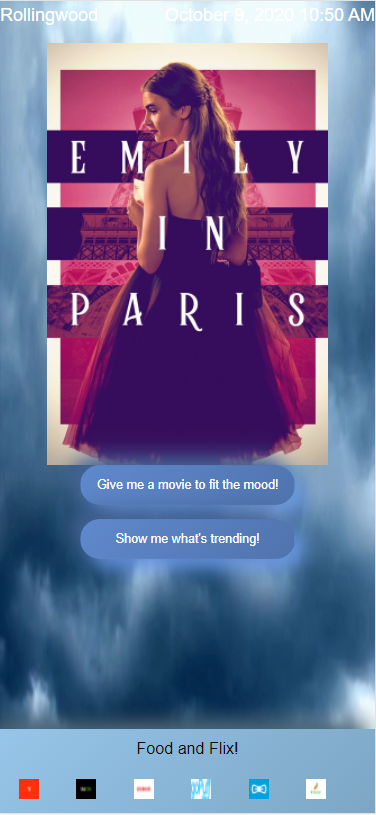

    

# Meteorology and motion pictures

# Application Does:
* Our app uses the Openweather API and the TMDB API to recommend movies that will fit your mood depending on how sunny or gloomy the weather is in your area. 

# Technologies used:
* HTML5
* CSS3 , Bootstrap
* JavaScript, Openweather API, TMDB API, AJAX

# Features
* Geolocator
* Filter through Movies
* Order Food

# Sample web page

 
 
# Depolyed Application
 https://daniel-rodriguez210.github.io/MovieWeatherRecs/

# Github repository
 https://github.com/Daniel-Rodriguez210/MovieWeatherRecs

# Contributing
 *drod18@hotmail.com
 *https://github.com/WRugby1
 *https://github.com/kroarguello

@copyright 2020
